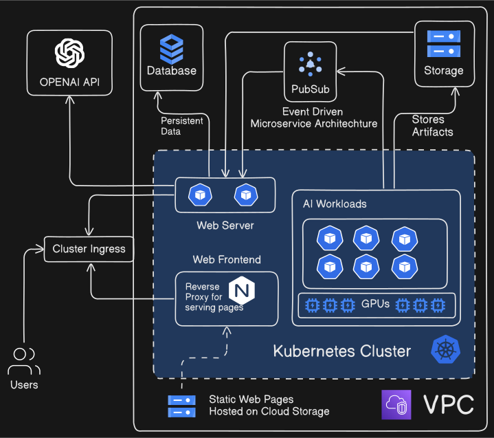

# Software Requirements Specification (SRS)

**Project Name:** Gen Videa

Prepared by Group 6

* Umer Naeem
* Syed Haider Ali Naqvi
* Maham Ali
* Abdullah Hashmat
* Wajih Sami Siddiqui

**Date:** 4 February 2024
**Effort:** 8 hours

**Instructor:** Maryam Abdul Ghafoor - _SBASSE-LUMS_

## 1 Introduction

### 1.1 Proposal

#### Feature #1: Personalized AI based Video Enhancement

* **Description:** Users can generate custom AI reels by uploading their videos. The platform utilizes pre-trained generative models, which are fine-tuned to match user preferences for style, expression, and theme.
* **Rationale:** Enhances user engagement by providing a personalized experience and creative freedom without the need for advanced Video Editing Skills.
* **Implementation:** We will integrate existing generative AI libraries, fine-tuning them with user-provided data to ensure avatars meet personalized criteria.

### Feature #2: Automated Video Narration

* **Description:** The platform will offer an automated narration feature, converting text scripts into natural-sounding speech. Users can input their scripts or leverage AI to generate contextually relevant content. The text-to- speech engine will provide a range of voices and languages to choose from.
* **Rationale:** Reduces the time and resources required for content production, making it more accessible for users with varying budgets and technical capabilities.
* **Implementation:** We will use existing text-to-speech APIs to support this feature, ensuring a wide selection of voices and languages.

### Feature #3: Automated Video Captioning

• **Description:** Users will have access to automated captioning tools that transcribe spoken words into text, providing subtitles for videos. The AI will support multiple languages and dialects for broader accessibility.

* **Rationale:** Enhances the reach and inclusivity of video content by making it accessible to non-native speakers and the hearing impaired.
* **Implementation:** We will incorporate existing speech-to-text services to generate accurate and timely captions for videos.

### Feature #4: AI-Powered Diffusion Model Short Clip Generation

* **Description:** The platform will enable users to create short video clips (3-5 seconds) using advanced diffusion models that convert still images into dynamic video sequences. This feature allows for the generation of unique and engaging clips that can be used individually or stitched together for longer narratives.
* **Rationale:** Provides users with the ability to craft original content with minimal effort, sparking creativity and offering a new form of expression. It also caters to the growing demand for short-form content on social media platforms.
* **Implementation:** We will integrate state-of-the-art diffusion models capable of image-to-video transformations. Users can input images and select desired motion and style parameters to generate short clips. These can then be edited and combined using the platform's video editing tools to create cohesive content.

### 1.2 GitHub Setup

[x] Instructor and Assigned TA are added as collaborator.
[x] Github Boards are setup.

Github Board: https://github.com/users/BlockchainFreak/projects/2/views/1

Github Repo: https://github.com/BlockchainFreak/gen-videa

## 2 Overall Description

### 2.1 Product Perspective

GenVidea is a web-based application that serves as a comprehensive platform for video generation and enhancement, leveraging the power of generative AI. It is designed as a self-contained product but with potential for future integration into a larger ecosystem of digital media tools. The application interfaces with various external services, including OpenAI for access to GPT-4 and other features, and Google Cloud Storage for secure media storage. The backend infrastructure is built on Kubernetes, enabling scalable and efficient processing of video and AI tasks.

The product is positioned to fill a niche in the digital content creation market, offering advanced video enhancement and generation features that are accessible to users without extensive technical expertise. The system architecture facilitates asynchronous processing of media, with a focus on user interaction through a web interface for uploading and managing content.

### 2.2 Product Features

* AI-Driven Video Enhancement: Users can upload videos for AI-powered enhancements, including quality improvements and stylistic modifications.
* Content Generation with AI Prompts: Leveraging GPT-4, users can input prompts to guide the AI in generating themed video content.
* Automated Video Narration: The platform supports automated narration in multiple languages, enhancing accessibility and user engagement.
* Secure Media Storage: User content is stored in a private Google Cloud Storage bucket, with access controlled via pre-signed URLs.
* Scalable Processing Infrastructure: Built on Kubernetes, the platform can scale horizontally to meet demand, with specific considerations for OpenAI request limits and GPU resource scaling.
* Content Moderation: AI-generated content is moderated through automated checks and human review to ensure appropriateness.
* User Authentication: Secure login with JWT tokens, utilizing Argon for password hashing, in compliance with CCPA.

### 2.3 Users and Characteristics

Most Important Users:

* Content Creators: Professionals or hobbyists looking to produce or enhance video content with minimal effort. They value the platform's ease of use and the quality of AI-generated enhancements. They are crucial because they are likely to be paying customers and generate revenue for the platform. Meeting their needs and ensuring the platform's ease of use and high-quality AI enhancements should be a top priority.
* Individuals Seeking Quick Enhancements: Users in need of rapid video improvements for personal or professional use, benefiting from automated features like video narration and AI-driven effects. These users are important because they represent a significant user base. Automated features should be optimized to cater to their needs and provide a positive user experience.

Less Important Users:

* Creative and Recreational Users: Individuals exploring the platform for entertainment or to experiment with AI-generated video content, likely to engage with community features like content sharing. While these users are valuable for community engagement and may contribute to content sharing and user-generated content, they may not be as directly tied to revenue generation. Their needs should still be considered but may not take precedence over the primary user groups.

### 2.4 Assumptions

* OpenAI API Usage: It is assumed that the OpenAI API, particularly GPT-4, will be available and stable throughout the development and operation of the GenVidea platform. This includes the assumption that OpenAI's usage limits and pricing will remain favorable for the project's scalability and budget.
* User Engagement Levels: We assume a moderate level of user engagement with the platform's features. This includes assumptions about the frequency and intensity of video uploads, AI processing requests, and the use of generative content features. Significant deviations in user behavior could impact system performance and cost projections.
* GPU Resource Availability: The project assumes that GPU resources required for AI workloads will be readily available on demand from Google Cloud Platform (GCP). This includes an assumption about the scalability of GPU quotas and the cost associated with scaling these resources.
* Data Privacy Regulations Compliance: It is assumed that the platform's data handling and privacy practices will be in compliance with the California Consumer Privacy Act (CCPA) and will not require major adjustments to meet these or other emerging data protection standards.
* Third-Party Service Reliability: The reliability of third-party services, including Google Cloud Storage, Google Cloud SQL, and any integrated APIs for content moderation, is assumed. Any significant downtime or degradation in these services could affect the platform's performance and user experience.

### 2.5 Operating Environment

The GenVidea platform is designed with a microservices architecture, leveraging various technologies and services to ensure scalability, performance, and reliability. The operating environment for the platform includes:

* Frontend Application: The user interface is served as static pages hosted in a Google Cloud Storage Bucket. These pages are delivered through a reverse Nginx proxy running within a Kubernetes cluster, ensuring efficient content delivery and scalability.
* Backend Web Server: The backend logic is implemented in Python and runs on a lightweight Linux distribution, Alpine, within Docker containers. These containers are orchestrated as pods within a Kubernetes cluster, allowing for dynamic scaling and management of the web server instances.
* AI Workloads: AI-related processing tasks, including video enhancement and generative content creation, are handled by applications running on Ubuntu with CUDA drivers. These applications are containerized and deployed on GPU-provisioned Kubernetes nodes, ensuring that AI workloads can leverage dedicated GPU resources for accelerated processing.
* Database: The platform utilizes PostgreSQL for data storage, managed by Google Cloud SQL. This managed service provides a reliable, scalable database environment with automated backups, patch management, and performance tuning.

This operating environment supports the GenVidea platform's requirements for high availability, scalability, and efficient processing of AI workloads. It also facilitates the development and deployment of new features and updates, ensuring that the platform can evolve to meet user needs and leverage advancements in AI and cloud technologies.

## 3 Specific Requirements

### 3.1 Functional Requirements

#### User Authentication and Security

* **RQ1:** The system shall authenticate users via email and password, issuing JWT tokens for session management.
* **RQ2:** User passwords shall be hashed using Argon2 for secure storage.

#### Data Privacy and Content Handling

* **RQ3:** User-uploaded content shall be stored in a private Google Cloud Storage bucket, accessible only through pre-signed URLs generated by the web server.
* **RQ4:** All user data and content shall be retained for no more than one year, in compliance with data privacy standards.

#### Integration with External Services

* **RQ5:** The system shall integrate with OpenAI's API for accessing GPT-4 and other AI features, adhering to usage limits and scalability considerations.
* **RQ6:** The platform shall not integrate payment gateways at this stage, focusing on core functionalities.

#### Performance and Scalability

* **RQ7:** The backend infrastructure, running on Kubernetes, shall automatically scale to meet demand, with specific strategies for managing GPU resources and external API request limits.

#### Localization and Internationalization

* **RQ8:** Automated video narration shall support multiple languages, enhancing the platform's accessibility to a broader user base.

#### Content Moderation

* **RQ9:** AI-generated content shall undergo automated moderation using vision APIs and negative prompt filtering, with a manual review process for content flagged by users.

#### Offline Functionality and Data Syncing

* **RQ10:** In case of client disconnection, the system shall ensure data syncing upon reconnection, maintaining the integrity of user sessions and content processing tasks.

### 3.2 External Interface Requirements

#### 3.2.1 User Interfaces

1. **Logical Characteristics:** The GenVidea platform will provide a Graphical User Interface (GUI) accessible via web browsers. The GUI will be designed to offer intuitive navigation and interaction for a wide range of users, from content creators to casual users seeking video enhancement options. The interface will include elements such as media upload options, AI feature selection, user account management, and a gallery of AI-generated content.
2. **Optimization Aspects:** The interface will be optimized for accessibility, adhering to Web Content Accessibility Guidelines (WCAG) to ensure it is usable by people with disabilities. This includes providing text alternatives for non-text content, making functionality available from a keyboard, and ensuring predictable navigation. Additionally, the interface will be responsive, ensuring usability across various devices and screen sizes.

#### 3.2.2 Software Interfaces

* **Operating System:** The backend components of GenVidea, including the web server and AI workloads, will be designed to run in a containerized environment on Kubernetes, making them largely operating system agnostic. However, the containers will be based on lightweight Linux distributions (Alpine for the web server and Ubuntu for AI workloads) to ensure efficiency and compatibility with CUDA drivers for GPU acceleration.
* **Databases:** The platform will interface with PostgreSQL managed by Google Cloud SQL, facilitating data storage and retrieval for user accounts, video metadata, and AI-generated content.
* **External APIs:** GenVidea will integrate with the OpenAI API for accessing GPT-4 functionalities and Google Cloud Storage for media uploads and storage. The platform will handle API requests and responses for AI processing tasks and media management.
* **Data Sharing:** Shared data across software components will include user credentials, video files, AI processing parameters, and generated content metadata. Secure API endpoints will facilitate data exchange, with authentication and authorization mechanisms in place to ensure data privacy and security.

## 4 Non-functional Requirements

### 4.1 Performance Requirements

1. **Response Time:** Web application responses for navigation and non-processing tasks shall not exceed 2 seconds under normal operating conditions to ensure a smooth user experience.
2. **AI Processing Time:** Video enhancement and AI-generated content creation tasks shall be completed within an acceptable timeframe, not exceeding 12 minutes for standard video lengths.
3. **Scalability:** The system shall automatically scale to support up to 1,000 concurrent users without degradation in performance, leveraging Kubernetes' horizontal pod autoscaling.
4. **Database Transactions:** Database read and write operations shall complete within 100 milliseconds under typical load conditions to ensure timely data access and storage.
5. **Content Delivery:** Media content delivery to the end-user, including AI-enhanced videos, shall not exceed 10 seconds, ensuring timely access to generated content.

### 4.2 Safety and Security Requirements

* **Data Encryption:** All data in transit and at rest, including user credentials and video content, shall be encrypted using industry-standard encryption protocols (e.g., TLS for data in transit, AES-256 for data at rest).
* **User Authentication:** The platform shall implement JWT-based authentication with Argon2 hashing for password storage, ensuring secure access control.
* **Compliance:** The platform will comply with the California Consumer Privacy Act (CCPA), including provisions for data privacy, user consent for data processing, and the right to data deletion.

### 4.3 Software Quality Attributes

#### 4.3.1 Reliability

* The platform shall achieve 99.9% uptime, excluding scheduled maintenance windows. This will be accomplished through redundant infrastructure, automated failover mechanisms, and continuous monitoring.

#### 4.3.2 Usability

* The user interface shall be designed following user-centered design principles, ensuring ease of use and minimal learning curve. User feedback will be collected regularly to inform iterative improvements.

#### 4.3.3 Maintainability

* The codebase shall adhere to industry best practices for coding standards and documentation. Modular design and containerization will facilitate easy updates and maintenance.

#### 4.3.4 Scalability

* The system's architecture shall support scaling operations both vertically and horizontally to accommodate growing user demand and data processing needs without significant redesign.

## 5 Backlog Tracking

### 5.1 Product Backlog

Story Title | User Story | Priority | Estimate Time
-- | -- | -- | --
Account Creation and Management | As a potential user, I want to create an account using my email and password so that I can access GenVidea's | 5 | 4 days
Automated Video Narration | As a video creator, I want to add automated narration to my videos using text-to-speech technology to make them more engaging. | 5 | 3 days
Video Upload and Processing | As a content creator, I want to upload my video files to the platform so that I can apply AI-driven enhancements | 4 | 3 days
AI-Driven Video Enhancement | As a user, I want to select and apply AI-driven video enhancement features to my uploaded videos to improve their quality and aesthetics. | 8 | 4 days
Content Generation with AI Prompts | As a user, I want to generate short videos clips based on an input image. | 7 | 4 days
User Content Privacy | As a user, I want the option to mark my content as public or private to control who can view my videos. | 2 | 2 days
User Content Privacy | As a user, I want the option to be able to view the public gallery to see results of other people | 4 | 2 days

### 5.2 Sprint Number 1 Backlog

<table>
    <thead>
        <tr>
            <td><strong>Priority</strong></td>
            <td><strong>User Story</strong></td>
            <td><strong>Tasks</strong></td>
            <td><strong>Assigned to</strong></td>
            <td><strong>Estimated time (hours)</strong></td>
        </tr>
    </thead>
    <tbody>
        <!-- Account Creation -->
        <tr>
            <td rowspan=4>1</td>
            <td rowspan=4>As a User I should be able to create an account</td>
            <td>Expose an API with JWT Auth</td>
            <td>Umer</td>
            <td>3</td>
        </tr>
        <tr>
            <td>Create a User Friendly UI for landing page signin/signup workflows</td>
            <td>Maham</td>
            <td>4</td>
        </tr>
        <tr>
            <td>Create a signin/signup forms for frontend</td>
            <td>Haider & Wajih </td>
            <td>6</td>
        </tr>
        <tr>
            <td>Write E2E test cases for login/signup functionality using Playwright in Frontend</td>
            <td>Abdullah</td>
            <td>2</td>
        </tr>
        <!-- Automatic Video Narration -->
        <tr>
            <td rowspan=4>2</td>
            <td rowspan=4>As a video creator, I want to add automated narration to my videos</td>
            <td>Expose APIs for handling video processing</td>
            <td>Umer</td>
            <td>6</td>
        </tr>
        <tr>
            <td>Create a User Friendly UI and wireframes for video narration workflow</td>
            <td>Maham</td>
            <td>4</td>
        </tr>
        <tr>
            <td>Implement simple page for making api calls, uploading videos, displaying videos</td>
            <td>Haider & Abdullah</td>
            <td>6</td>
        </tr>
        <tr>
            <td>Write End 2 End test cases for video narration functionality</td>
            <td>Wajih</td>
            <td>3</td>
        </tr>
    </tbody>
</table>

### Appendix B – Contribution Statement

| Name | Contributions in this phase | Approx. Number of hours | Remarks |
|------|-----------------------------|-------------------------|---------|
| Syed Haider Ali Naqvi     |      Section 2 and 3                       |        4                 |         |
| Umer Naeem     |          Section 2.1 diagram                   |            4             |    Handled non-documenting work like creating Repo, board etc      |
| Maham Ali     |           Section 4                  |              4           |         |
| Abdullah Hashmat     |         Section 5                    |            4             |         |
| Wajih Sami Siddiqui     |        Section 1 and 3                     |          4               |         |

